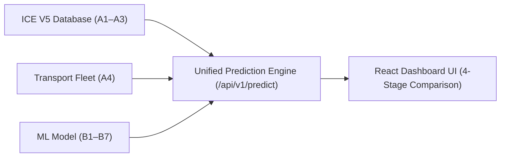

# 🌿 Project Vardan (Phase 1)
### Universal Materials Intelligence & Climate Resilience Platform

Project Vardan predicts the dynamic **100-year Global Warming Potential (GWP)** of construction materials under user-defined climate stress scenarios, combining **ICE V5 embodied carbon baselines**, **LCA Stage A4 transport logistics**, and a **Random Forest ML engine**.

---

## 🏗️ Architecture & LCA Stages

Project Vardan maps directly to the international Life Cycle Assessment standards (**EN 15978 / ISO 21930 / ICE V5**):

* **Stage A1–A3 (Product Stage):** Baseline embodied carbon extracted from the ICE V5 database (`data/ICE_V5_Cleaned_Materials.csv`).
* **Stage A4 (Construction Stage — Transport):** Logistics transit emissions calculated via the fleet emissions engine (`backend/app/services/transport_service.py`).
* **Stage B1–B7 (Use Stage — Operational Resilience):** 100-year dynamic climate stress degradation modelled via Random Forest Regressor (`models/gwp_100yr_model.joblib`).



For full mathematical formulas and physics explanations of the transport module, see [**Transportation Module Documentation**](docs/TRANSPORTATION_MODULE.md).

---

## 🚀 Quick Start

### 1. Backend Setup (FastAPI)
```bash
cd backend
python -m pip install -r requirements.txt
python -m uvicorn app.main:app --reload --port 8000
```
- **API Swagger Documentation:** [http://localhost:8000/docs](http://localhost:8000/docs)
- **API Redoc Documentation:** [http://localhost:8000/redoc](http://localhost:8000/redoc)

### 2. Frontend Setup (React + Vite)
```bash
cd frontend
npm install
npm run dev
```
- **Live Dashboard:** [http://localhost:5173](http://localhost:5173)

---

## 📡 REST API Reference

| Method | Endpoint | Description |
| :--- | :--- | :--- |
| `GET` | `/api/v1/materials` | Lists all 259 ICE V5 construction materials. |
| `GET` | `/api/v1/materials/{name}/base-gwp` | Returns baseline embodied carbon (A1–A3) for a specific material. |
| `GET` | `/api/v1/transport/vehicles` | Returns fleet vehicle specifications (curb weight, base emission rate). |
| `POST` | `/api/v1/transport/calculate` | Standalone calculation for vehicle transportation emissions (A4). |
| `POST` | `/api/v1/predict` | Unified prediction combining A1–A3 Base GWP, A4 Transport, and 100-year Calamity GWP. |

---

## 🚢 Deployment on Render

Project Vardan is configured for 1-click deployment on **Render** via [`render.yaml`](render.yaml):

1. Go to [dashboard.render.com](https://dashboard.render.com/).
2. Create a new **Web Service** or **Blueprint** connected to your repository.
3. **Build Command:**
   ```bash
   cd frontend && npm install && npm run build && cd ../backend && pip install -r requirements.txt
   ```
4. **Start Command:**
   ```bash
   cd backend && uvicorn app.main:app --host 0.0.0.0 --port $PORT
   ```

---

## 📂 Project Structure

```text
├── backend/
│   ├── app/
│   │   ├── api/v1/endpoints.py       # REST API Routes
│   │   ├── schemas/
│   │   │   ├── gwp_schema.py         # Unified GWP Pydantic schemas
│   │   │   └── transport_schema.py   # Transportation Pydantic schemas
│   │   ├── services/
│   │   │   ├── material_service.py   # ICE V5 Material lookup service
│   │   │   ├── prediction_service.py # ML model inference service
│   │   │   └── transport_service.py  # Vehicle fleet emissions engine
│   │   ├── config.py                 # App configuration & settings
│   │   └── main.py                   # FastAPI entrypoint & SPA static server
│   └── requirements.txt              # Python dependencies
├── data/
│   └── ICE_V5_Cleaned_Materials.csv  # Cleaned ICE V5 material database
├── docs/
│   └── TRANSPORTATION_MODULE.md      # Detailed Transport LCA Stage A4 documentation
├── frontend/
│   ├── src/
│   │   ├── components/
│   │   │   ├── Dashboard.jsx         # Main React Dashboard UI
│   │   │   └── Dashboard.css         # Styling & responsive design
│   │   ├── App.jsx
│   │   └── main.jsx
│   └── package.json
├── models/
│   └── gwp_100yr_model.joblib        # Pre-trained Random Forest ML Model
├── render.yaml                       # Render Deployment Blueprint
└── README.md
```
