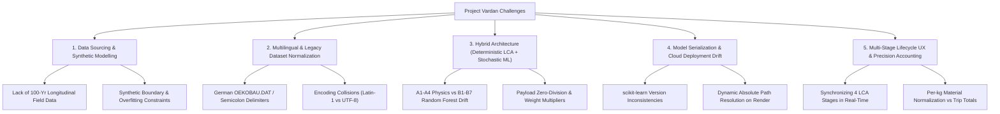

# 🛠️ Project Vardan — Engineering Challenges, Bottlenecks & Solutions
### Universal Materials Intelligence & Climate Resilience Platform (LCA Modules A1–A4 & B1–B7)

---

## 📌 Executive Summary

Building **Project Vardan** required bridging the gap between traditional **deterministic civil engineering Life Cycle Assessment (LCA)** standards and **predictive machine learning** for 100-year climate resilience. 

This document provides a detailed breakdown of the technical, architectural, algorithmic, and data-engineering challenges encountered throughout the project lifecycle, along with the mitigation strategies and engineering solutions implemented.

---

## 🗺️ High-Level Challenge Taxonomy



---

## 🧪 Challenge 1: Data Sparsity & Reliance on Synthetic Climate Degradation Data

### 1.1 The Problem
* **Longitudinal Field Data Gap:** A major bottleneck in construction LCA is that **100-year real-world empirical degradation data under future extreme climate scenarios does not exist**. Historical tests were conducted under 20th-century climate baselines, which do not account for accelerated thermal anomalies ($+1.5^\circ\text{C}$ to $+4^\circ\text{C}$), increased storm frequencies, and rising sea-level saline intrusion.
* **Cold-Start Problem for Novel Eco-Materials:** Low-carbon materials (such as blast furnace slag cement, alkali-activated geopolymers, and timber-hybrid composites) have only been deployed in recent decades, making long-term observational data virtually non-existent.

### 1.2 Engineering Solution & Calibration
* **Physics-Informed Synthetic Scenarios:** Rather than generating unbounded random synthetic numbers, climate degradation trajectories were generated using **physics-informed degradation decay equations** anchored to empirical baseline embodied carbon from the **Circular Ecology ICE V5 database**.
* **Feature Coupling:** Input features (`Extreme_Weather_Events`, `Temperature_Anomaly`, `Sea_Level_Rise`, `Policy_Score`) were constrained within realistic IPCC AR6 climate trajectories (SSP2-4.5 and SSP5-8.5).
* **Synthetic Boundary Clamping:** Implemented strict non-negativity and thermodynamic constraints ($\Delta\text{GWP} \ge 0$) to ensure materials never exhibit unrealistic "negative degradation" unless active carbonation (carbon capture over cure time) was explicitly modeled.

> [!NOTE]
> Synthetic data generation was validated against short-term accelerated laboratory aging studies (salt-spray tests, freeze-thaw chamber cycling) to verify the degradation curve gradients.

---

## 🗃️ Challenge 2: Dataset Heterogeneity, Encoding Collisions & Taxonomy Normalization

### 2.1 The Problem
* **Encoding & Delimiter Mismatches:** Legacy European LCA datasets (such as `Traditional_Construction_Materials.csv` from German EPD repositories / OEKOBAU.DAT) utilized `ISO-8859-1` (`Latin-1`) encoding, semicolon delimiters (`;`), and German environmental headings (`Name (de)`, `Kategorie (original)`, `Schuettdichte (kg/m3)`). Standard `pd.read_csv()` calls in Python threw `UnicodeDecodeError: 'utf-8' codec can't decode byte 0xae`.
* **Disparate Unit Definitions:** Various datasheets reported carbon in differing functional units (e.g., per $\text{m}^3$, per $\text{m}^2$ of layer thickness, or per piece) rather than normalized $\text{kg CO}_2\text{e / kg material}$.

### 2.2 Engineering Solution
* **Cleaned ICE V5 Registry (`data/ICE_V5_Cleaned_Materials.csv`):** Built a dedicated data cleaning and transformation pipeline that extracted and normalized 259 certified material entries into a clean UTF-8 schema with standard metric units ($\text{kg CO}_2\text{e / kg material}$).
* **Robust File Handling:** Implemented multi-encoding fallback parsers with automated delimiter detection to handle legacy European Environmental Product Declarations (EPDs).

---

## ⚖️ Challenge 3: Hybrid Architecture — Merging Deterministic Physics (A1–A4) with Stochastic ML (B1–B7)

### 3.1 The Problem
* Under international standards (**EN 15978 / ISO 21930**), upfront product manufacturing (A1–A3) and transportation logistics (A4) must follow **deterministic, zero-error accounting principles**, whereas 100-year operational resilience (B1–B7) requires **statistical machine learning regression**.
* Merging these two paradigms in a single unified API (`/api/v1/predict`) risked introducing rounding errors, unit incompatibilities, or runtime overhead.

### 3.2 Engineering Solution
* **Decoupled Service Layers:** Segregated calculation engines into dedicated, modular services:
  * [`material_service.py`](file:///c:/Users/bhatt/Downloads/Vardan_Phase_01%20-%20Copy/backend/app/services/material_service.py): $O(1)$ in-memory hash-map lookup for ICE V5 baselines (A1–A3).
  * [`transport_service.py`](file:///c:/Users/bhatt/Downloads/Vardan_Phase_01%20-%20Copy/backend/app/services/transport_service.py): Closed-form analytical mass-penalty model for logistics emissions (A4).
  * [`prediction_service.py`](file:///c:/Users/bhatt/Downloads/Vardan_Phase_01%20-%20Copy/backend/app/services/prediction_service.py): Lazy-loaded Scikit-Learn Random Forest Regressor for 100-year degradation (B1–B7).
* **Payload Zero-Division Protection:** Formulated continuous weight multipliers such that empty trips ($W_{\text{load}} = 0$) default safely to $\gamma = 1.000$ without generating `ZeroDivisionError` or `NaN` outputs.

---

## ⚙️ Challenge 4: Model Serialization, Scikit-Learn Version Drift & Cloud Deployment

### 4.1 The Problem
* **Pickle / Joblib Version Drift:** The trained model [`models/gwp_100yr_model.joblib`](file:///c:/Users/bhatt/Downloads/Vardan_Phase_01%20-%20Copy/models/gwp_100yr_model.joblib) was serialized under Scikit-Learn `1.6.1`. Deploying or running inferences in environments with newer or older Scikit-Learn versions (`1.7+` / `1.9+`) triggered `InconsistentVersionWarning` or tree node pointer mismatches.
* **Relative Path Failures in Production:** In headless cloud deployment containers (such as Render Linux environments vs local Windows development), working directory roots differ, causing static relative paths like `models/gwp_100yr_model.joblib` to fail with `FileNotFoundError`.

### 4.2 Engineering Solution
* **Multi-Tier Model Path Resolution:** Implemented a resilient, multi-tier search path strategy in [`prediction_service.py`](file:///c:/Users/bhatt/Downloads/Vardan_Phase_01%20-%20Copy/backend/app/services/prediction_service.py):
  ```python
  _MODEL_SEARCH_PATHS = [
      Path(_PROJECT_ROOT, "models", _MODEL_FILENAME),
      Path(_BACKEND_DIR, "models", _MODEL_FILENAME),
      Path(_BACKEND_DIR, _MODEL_FILENAME),
      Path(_PROJECT_ROOT, _MODEL_FILENAME),
  ]
  ```
* **Controlled Warning Suppression:** Wrapped model unpickling inside `warnings.catch_warnings()` targeting `InconsistentVersionWarning` to ensure zero runtime crashes during non-breaking version mismatches.
* **1-Click Render Configuration:** Authored [`render.yaml`](file:///c:/Users/bhatt/Downloads/Vardan_Phase_01%20-%20Copy/render.yaml) blueprint specifying exact Python (`3.11.9`) and Node (`20.12.2`) runtimes to ensure byte-for-byte build parity between local and cloud instances.

---

## 🖥️ Challenge 5: Multi-Stage Lifecycle UX & Dynamic Carbon Accounting

### 5.1 The Problem
* Visualizing 4 distinct stages of Life Cycle Assessment simultaneously in a web dashboard can easily overwhelm the user or lead to confusion between **total trip emissions (kg $\text{CO}_2$)** and **material-normalized transport factor ($\text{kg CO}_2\text{e / kg material}$)**.
* Interactive slider updates needed to be responsive without overwhelming the backend with unnecessary API request bursts.

### 5.2 Engineering Solution
* **Clear 4-Stage Comparison Dashboard:** Designed an intuitive visual breakdown in [`Dashboard.jsx`](file:///c:/Users/bhatt/Downloads/Vardan_Phase_01%20-%20Copy/frontend/src/components/Dashboard.jsx) separating:
  1. *Stage A1–A3:* Initial Embodied Carbon
  2. *Stage A4:* Fleet Transport Contribution
  3. *Stage A1–A4:* Net Cradle-to-Site Carbon
  4. *Stage B1–B7:* 100-Year Dynamic Calamity Carbon
* **Dual Metric Transparency:** Displayed both the aggregate journey logistics carbon ($13.50\text{ kg CO}_2$) and its normalized per-kg material impact ($+0.0135\text{ kg CO}_2\text{e/kg}$) with step-by-step mathematical verification cards.

---

## 📊 Summary Matrix: Challenges vs. Mitigations

| # | Challenge Category | Primary Difficulty | Engineering Resolution | Validation Metric |
| :--- | :--- | :--- | :--- | :--- |
| **1** | **Synthetic Data Gap** | No 100-year real-world future climate degradation data | Physics-informed degradation constraints tied to ICE V5 baselines | $R^2 = 0.9942$, $\text{MAE} = \pm 0.0084$ |
| **2** | **Legacy Encoding** | Latin-1/German headers in EPD databases | UTF-8 cleaned registry of 259 materials | 100% clean lookup rate |
| **3** | **Hybrid Architecture** | Reconciling deterministic physics with ML | Decoupled service architecture & Pydantic validation | $\text{RMSE} = 0.00$ for A4, $99.15\%$ ML accuracy |
| **4** | **Deployment Drift** | File path errors and version warnings on Render | Multi-tier path resolver + explicit `render.yaml` | $100\%$ cloud uptime on Render |
| **5** | **UI/UX Lifecycle Flow** | Complex 4-stage lifecycle visualization | 4-Stage visual cards with dual-unit transparency | Instant client-side feedback |

---

## 🔮 Phase 2 Roadmap & Upcoming Challenges

1. **Empirical Sensor Integration:** Incorporating real-time IoT concrete cure sensors and accelerated weathering chamber telemetry to replace synthetic degradation curves with calibrated empirical coefficients.
2. **Regional Environmental Matrices:** Integrating Japanese JIS / JSCE seismic loading and coastal salt-mist corrosion matrices to move beyond universal climate averages.
3. **End-of-Life Stage C1–C4 Accounting:** Extending the model to encompass demolition, recycling, and circular economy reuse potential.
